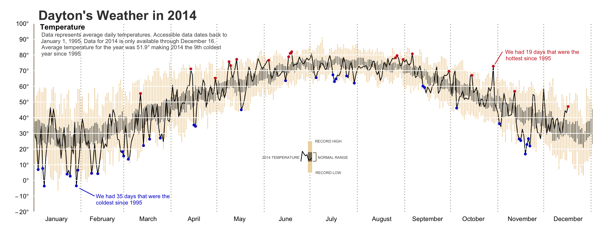
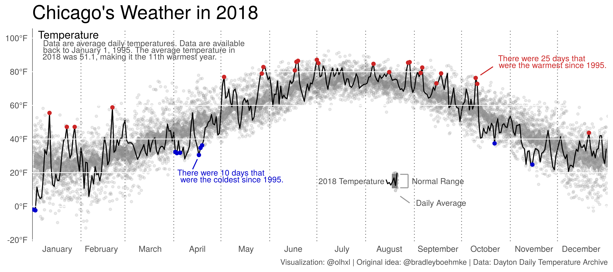

Chicago's Weather in 2018
================
2019-11-01 17:00:00 -5000

Inspired by [this](https://twitter.com/CedScherer/status/1170674809983905792) and because I had just learned that the Deutsche Wetterdienst (DWD; German Meteorological Service) publishes daily [weather data](https://www.dwd.de/DE/leistungen/klimadatendeutschland/klarchivtagmonat.html) going back decades, I wanted to replicate a graph I had seen some time ago.

[Bradley Boehmke](https://twitter.com/bradleyboehmke) elaborated on a graph by Edward Tufte and came up with this:



He describes his workflow [here](https://rpubs.com/bradleyboehmke/weather_graphic).

Initially, I just wanted to see whether I could replicate the graphic. In doing so, a number of technical and aesthetic choices/problems came up that I want to discuss. Most importantly, I tried to stick as much as possible to base R, except for `ggplot`. Hence the post.

We start out by defining a minimalist theme.

``` r
library(ggplot2)

# Define new theme.
temp_theme <- theme_bw()+
    theme(plot.background = element_blank(),
          plot.title = element_text(size = 20),
          plot.caption = element_text(size = 8, colour = "gray30"),
          panel.grid.minor = element_blank(),
          panel.grid.major = element_blank(),
          panel.border = element_blank(),
          panel.background = element_blank(),
          axis.ticks = element_blank(),
          #axis.text = element_blank(),
          axis.title = element_blank())

# Set new theme as default.
theme_set(temp_theme)
```

Then we get the temperatures. The DWD data comes in zipped .txt files. For some reason, they use `;` as the separator and `.` as the decimal point, so neither `read.csv` nor `read.csv2` will work with default parameters. Note too that the DWD website proposes a "current" and a "historical" dataset for every weather station. I'm not sure whether this is always the case, but for the weather station that I chose, the two overlapped in time.

``` r
file01 <- "../data/produkt_klima_tag_19470101_20181231_04271.txt"
file02 <- "../data/produkt_klima_tag_20180307_20190907_04271.txt"

dt01 <- read.csv(file01, header = TRUE, sep = ";", dec = ".")
dt02 <- read.csv(file02, header = TRUE, sep = ";", dec = ".")
```

Formatting dates is one task where one might be tempted to resort to non-base R packages, specifically the [`lubridate`](https://lubridate.tidyverse.org/) package. On the other hand, `as.Date` and `format` do a perfectly good job and you don't have to learn new function names. You probably do have to look up `?strptime` for the conversion codes.

``` r
# Remove 2019 from "current" data
dt02 <- dt02[format(as.Date(as.character(dt02$MESS_DATUM), "%Y%m%d"), "%Y") != "2018",]
# TMK is average daily temperature.
dt <- rbind(dt01[, c("MESS_DATUM", "TMK")], dt02[, c("MESS_DATUM", "TMK")])
dt$MESS_DATUM <- as.character(dt$MESS_DATUM)
dt$date <- as.Date(dt$MESS_DATUM, format = "%Y%m%d")
dt$yearday <- as.integer(format(dt$date, "%j"))
```

Now, while the temperatures in Rostock-Warnemünde might be interesting to me personally, I changed my goal to Chicago because I wanted to check whether its last few winters were really as bad as people say. This has nothing to do whatsoever with Rostock-Warnemünde's temperate climate and the resulting absence of exceptionally warm or exceptionally cold days. Nope.

To get Chicago data, I took the easy route and went to the amazing [Daily Average Temperature Archive](http://academic.udayton.edu/kissock/http/Weather/) at the University of Dayton. As the name says, they only provide average temperatures. This going to be the first difference in my plot. I won't be plotting daily (for 2018) or average (for previous years) minimum and maximum temperatures but instead focus on average temperatures. Again, I use base R to format the dates.

``` r
# Dayton Daily Temperature Archive: http://academic.udayton.edu/kissock/http/Weather/
url <- "https://academic.udayton.edu/kissock/http/Weather/gsod95-current/ILCHICAG.txt"
ch <- read.table(url, col.names = c("month", "day", "year", "temp"))
ch$date <- as.Date(paste(ch$year, ch$month, ch$day, sep = "-"), "%Y-%m-%d")
ch$yearday <- as.integer(format(ch$date, "%j"))
```

I remove the year 2019 because it is incomplete (not because it was a quite temperate year) and, after some preliminary plotting with strange outliers, I remove -99 values because the temperatures are in Fahrenheit and as cold as Chicago can be, that looks a lot like a missing code.

``` r
ch <- ch[ch$year != "2019",]
ch <- ch[ch$temp != "-99",]
```

The next step is to identify the historically lowest and highest temperatures, excluding last year. I also calculate a historical mean and standard errors because I want to plot a 95% interval region.

``` r
# max. and min. temperatures for past years except the last
past <- data.frame(phigh = as.vector(by(ch$temp[ch$year != max(ch$year)],
                                        ch$yearday[ch$year != max(ch$year)],
                                        function(x) max(x))),
                   plow = as.vector(by(ch$temp[ch$year != max(ch$year)],
                                       ch$yearday[ch$year != max(ch$year)],
                                       function(x) min(x))),
                   pmean = as.vector(by(ch$temp[ch$year != max(ch$year)],
                                        ch$yearday[ch$year != max(ch$year)],
                                        function(x) mean(x))),
                   pse = as.vector(by(ch$temp[ch$year != max(ch$year)],
                                      ch$yearday[ch$year != max(ch$year)],
                                      function(x) sd(x)/sqrt(length(x)))),
                   yearday = seq(1:366))
```

This next step is unnecessarily complicated. I could have just compared 2018's temperatures to the historical minimum and maximum, instead of calculating 2018's minimum and maximum and comparing that to the historical record. But my laziness to rewrite the code won out against my desire to appear smart.

``` r
# max. and min. temperatures for last year
lastyear <- data.frame(lhigh = as.vector(by(ch$temp[ch$year == max(ch$year)],
                                            ch$yearday[ch$year == max(ch$year)],
                                            function(x) max(x))),
                       llow =  as.vector(by(ch$temp[ch$year == max(ch$year)],
                                            ch$yearday[ch$year == max(ch$year)],
                                            function(x) min(x))),
                       yearday = seq(1:nrow(ch[ch$year == max(ch$year),])))

# merge into one dataset
hilos <- merge(past, lastyear, all.x = TRUE)
hilos$newhigh <- hilos$lhigh > hilos$phigh
hilos$newlow <- hilos$llow < hilos$plow
```

Now begins the plotting part. If you look back to Brad Boehmke's graphic, he plots dotted lines between months instead of the usual grid lines at the "middle" of the month. So we need to create a vector with the relevant coordinates. Note that BB did this manually by calling `geom_vline` for each break.

Similarly, we need to tell `ggplot` where to place the month labels.

``` r
months_intercepts <- c(31, 59, 90, 120, 151, 181, 212, 243, 273, 304, 334)
months_breaks <- c(16, 44, 75, 105, 136, 166, 197, 227, 258, 288, 319, 349)
```

Going back to BB's graphic, notice the small legend that he inserts below the temperature curve. I think that this really helps the legibility of the graphic. To create the mini-plot, we have to create fake data for the points and the line. Notice that the x-values and the y-mean determine where on the plot the legend will be situated.

``` r
# Synthetic data for small legend insert.
legend_line <- data.frame(x = seq(225,232), y = rnorm(8, 15, 3))
legend_points <- data.frame(x = seq(230, 232), y = rnorm(24, 15, 4))
```

Now for the big `ggplot` sequence.

``` r
p <- ggplot() +
    geom_jitter(data = ch, aes(x = yearday, y = temp, group = year),
                col = "grey60", fill = "grey60", alpha = .2,
                size = 1) +
    geom_ribbon(hilos,
                mapping = aes(x = yearday,
                              ymin = pmean - 1.96*pse,
                              ymax = pmean + 1.96*pse,
                              group = 1),
                fill = "grey50",
                alpha = .6) +
    geom_line(ch[ch$year == max(ch$year),],
              mapping = aes(x = yearday, y = temp, group = 1)) +
    geom_vline(xintercept = 0, linetype = 1, size = .5, col = "grey30") +
    geom_vline(xintercept = months_intercepts, linetype = 3, size = .4,
               col = "grey40") +
    geom_hline(yintercept = seq(-20, 100, 20), linetype = 1, size = .4,
               col = "white") +
    geom_point(hilos[hilos$newhigh == TRUE, ],
               mapping = aes(x = yearday, y = lhigh, group = 1), colour = "firebrick3") +
    geom_point(hilos[hilos$newlow == TRUE,],
               mapping = aes(x = yearday, y = llow, group = 1), colour = "blue3") +
    scale_x_continuous(expand = c(0, 0),
                       breaks = months_breaks,
                       labels = month.name) +
    coord_cartesian(ylim = c(-15, 100), xlim = c(0,366)) +
    scale_y_continuous(breaks = seq(-20, 100, 20),
                       labels = function(x) paste0(x, "°F"))
```

Add title and, almost more importantly, annotations. This is where we label the mini-legend/plot within the plot. I'm moderately happy with this solution. Too much manual fine-tuning. For now, all the parameters are hand-tuned and depend on the size and ratio of the output graphic.

``` r
p + ggtitle("Chicago's Weather in 2019") +
    labs(caption = "Visualization: @olhxl | Original idea: @bradleyboehmke | Data: Dayton Daily Temperature Archive") +
    annotate("segment", x = 102, xend = 105, y = 22, yend = 28, col = "blue3") +
    annotate("text", x = 120, y = 20,
             label = "There were 10 days that",
             size = 3, col = "blue3") +
    annotate("text", x = 127, y = 16,
             label = "were the coldest since 1995.",
             size = 3, col = "blue3") +
    annotate("segment", x = 293, xend = 285, y = 83, yend = 78, col = "firebrick3") +
    annotate("text", x = 324, y = 88,
             label = "There were 25 days that",
             size = 3, col = "firebrick3") +
    annotate("text", x = 331, y = 84,
             label = "were the warmest since 1995.",
             size = 3, col = "firebrick3") +
    annotate("text", x = 23, y = 102, label = "Temperature", size = 4) +
    annotate("text", x = 71, y = 97,
             label = "Data are average daily temperatures. Data are available",
             size = 3, col = "gray30") +
    annotate("text", x = 68, y = 93,
             label = "back to January 1, 1995. The average temperature in",
             size = 3, col = "gray30") +
    annotate("text", x = 62, y = 89,
             label = "2018 was 51.1, making it the 11th warmest year.",
             size = 3, col = "gray30") +
    geom_point(data = legend_points, mapping = aes(x = x, y = y),
               size = 1, col = "grey60", fill = "grey60", alpha = .4) +
    annotate("rect", xmin = 229, xmax = 232, ymin = 11, ymax = 19,
             col = "grey50", alpha = .6) +
    geom_line(data = legend_line, mapping = aes(x = x, y = y)) +
    annotate("text", x = 203, y = 15, label = "2018 Temperature",
             size = 3, col = "gray30") +
    annotate("segment", x = 234, xend = 239, y = 19, yend = 19, size = 0.5,
             col = "gray60") +
    annotate("segment", x = 234, xend = 239, y = 11, yend = 11, size = 0.5,
             col = "gray60") +
    annotate("segment", x = 239, xend = 239, y = 11, yend = 19, size = 0.5,
             col = "gray60") +
    annotate("text", x = 258, y = 15, label = "Normal Range",
             col = "gray30", size = 3) +
    annotate("segment", x = 234, xend = 240, y = 6, yend = 2, size = 0.5,
             col = "gray60") +
    annotate("text", x = 260, y = 2, label = "Daily Average",
             size = 3, col = "gray30")
```

And save.

``` r
ggsave(plot = last_plot(), filename = "../files/chi-temperature-2018.png", 
       width = unit(9, "inches"), height = unit(4, "inches"), dpi = 600)
```


