Bernie put his foot in it with [this
tweet](https://x.com/BernieSanders/status/1953127666153820382):

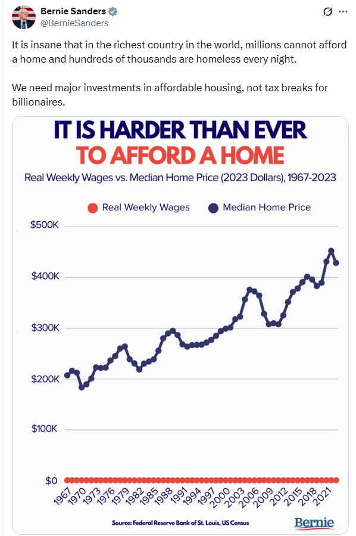

The y-axis in Bernie’s figure is appropriate for house prices but not
weekly earnings. Any plausible change in weekly earnings would be
compressed into a tiny part of the bottom.

# The short of it

What he should have used is this figure:

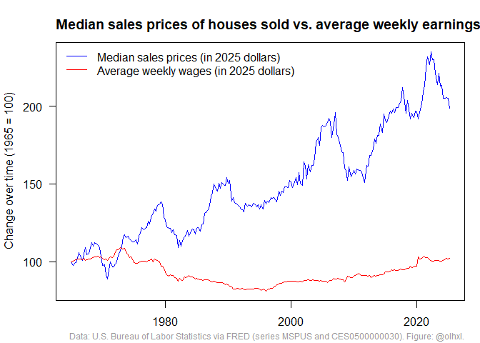

Another way to look at this is to ask “how many weeks of earnings does
it take to buy an ‘average’ house?”

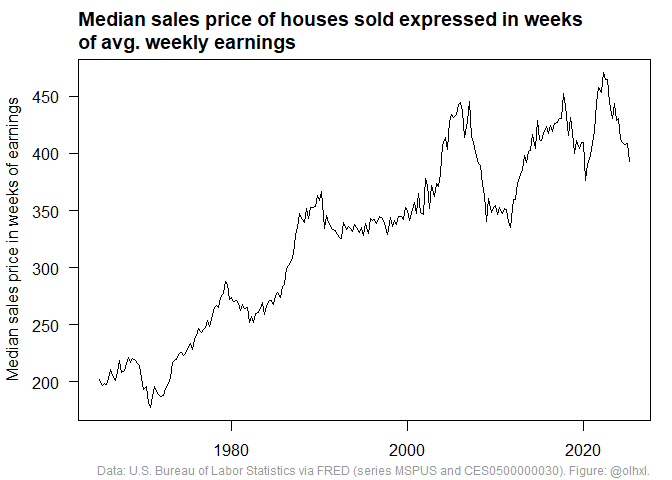

Sixty years ago, the median house cost about four years of wages and now
it costs between eight and nine years of wages.

Of course, 2025 houses are not the same as 1965 houses. Everyone knows
that millenials are entitled brats who consider 5 bedrooms, a jacuzzi,
and an avocado orchard the bare minimum, while their grandparents were
humble hardworking Jills and Joes who were content with a one-bedroom
shoe box.

I did find some data on prices per square feet. Unfortunately, it only
goes back to 2016 and shows the *listing price of houses on the market*
instead of *sales prices of houses sold*. (“Housing Inventory: Median
Listing Price per Square Feet in the United States”
[(MEDLISPRIPERSQUFEEUS)](https://fred.stlouisfed.org/series/MEDLISPRIPERSQUFEEUS)).
I’m sure that some digging on [IPUMS](https://www.ipums.org/) could turn
up something better but that was too much work for me.

Anyway, I’m sure all this gloom and doom is only because people were
happy with smaller houses sixty years ago and if we just revised our
expectations, we would see how much better we’re off.

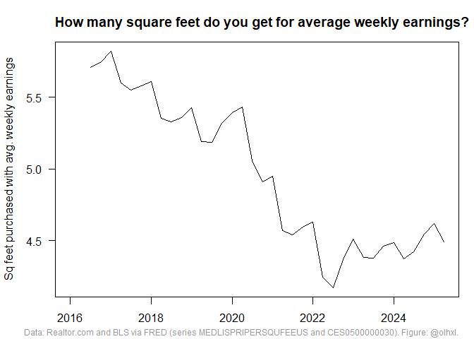

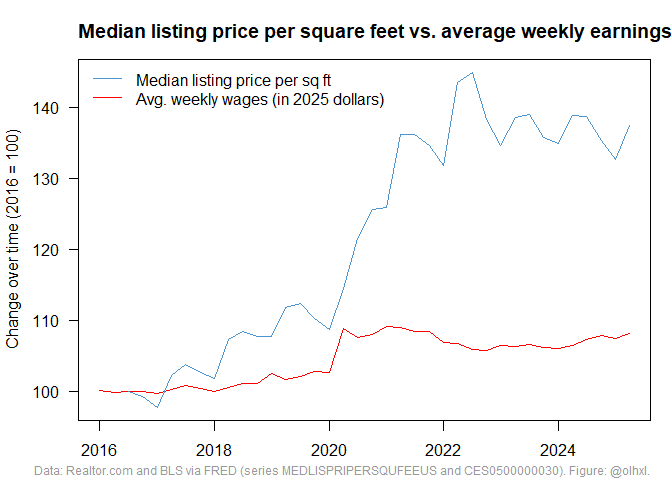

# The long of it

I looked through FRED for wages and house prices and I think the time
series in Bernie’s figure are “Average Weekly Earnings of Production and
Nonsupervisory Employees, Total Private”
([CES0500000030](https://fred.stlouisfed.org/series/CES0500000030)) and
“Median Sales Price of Houses Sold for the United States”
([MSPUS](https://fred.stlouisfed.org/series/MSPUS)). If we just look at
FRED figures, it’s hard to see anything informative. And, no, houses did
not cost \$0 before 1965. The first observation is \$17,800 for Q1 1963.

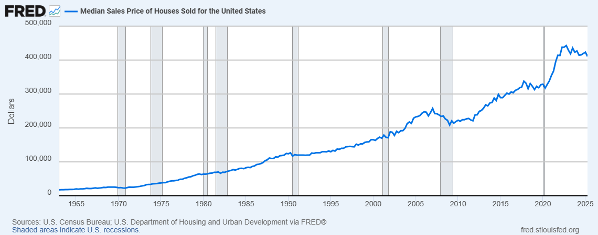

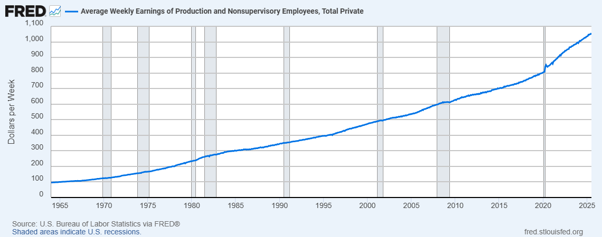

As mentioned above, we would prefer to compare earnings to prices per
square feet. During the period 2016-2025, the latter rose faster than
the former and you now get an entire square foot less for a week’s
earnings.

Looking at some FRED time series, it seems that something happened in 
2020\. Listed houses are on average 100 feet (5%) smaller after than 
before but prices did not drop proportionately.

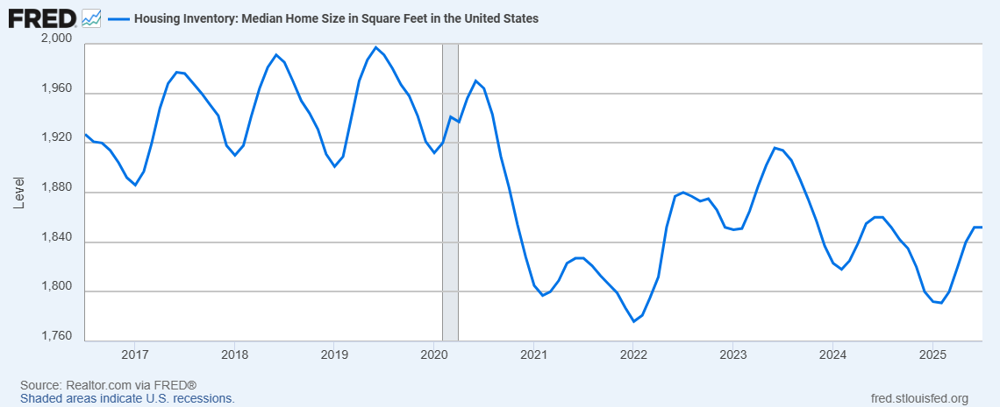

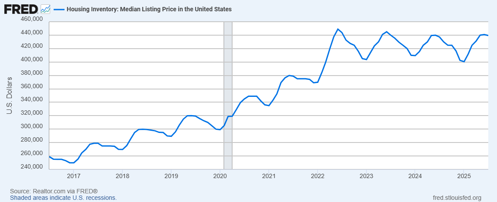

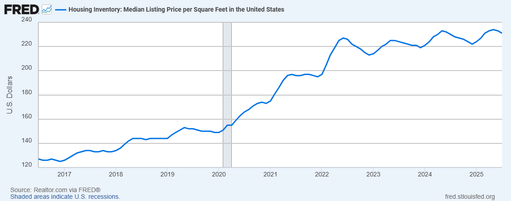

FRED series:

- Housing Inventory: Median Home Size in Square Feet in the United States [(MEDSQUFEEUS)](https://fred.stlouisfed.org/series/MEDSQUFEEUS)
- Housing Inventory: Median Listing Price in the United States [(MEDLISPRIUS)](https://fred.stlouisfed.org/series/MEDLISPRIUS)
- Housing Inventory: Median Listing Price per Square Feet in the United States [(MEDLISPRIPERSQUFEEUS)](https://fred.stlouisfed.org/series/MEDLISPRIPERSQUFEEUS)

# To disinflate or not to disinflate
The FRED series an sales prices and weekly earnings are in nominal
dollars, but people on the internet love adjusting for inflation. I
don’t think it matters in this case. If we take the ratio of prices to
earnings, “disinflating” (i.e. dividing by CPI) cancels out. If we
compare each quantity to itself over time, it also shouldn’t matter.

I am also not sure how consumer price indices are constructed exactly.
Did the part of housing in the different CPI change over time? If
housing became really cheap or expensive compared to food, gas, or Trump
Coins, would that be an argument for or against adjusting? If CPI
downweight housing over time because it became a smaller part of
household budgets, then we would want to use nominal prices to reflect
that greater affordability?

But everybody always adjusts for inflation so I do too. I use the
“Consumer Price Index for All Urban Consumers: All Items in U.S. City
Average” ([CPIAUCSL](https://fred.stlouisfed.org/series/CPIAUCSL))
because that’s what everybody seems to be using and the [Bureau of Labor
Statistics says](https://www.bls.gov/cpi/questions-and-answers.htm) that
it covers 90% of the U.S. population.

# Nominal figures

I think that there is an argument for using nominal figures (as in
numbers), so I redid all of the figures (as in pictures).

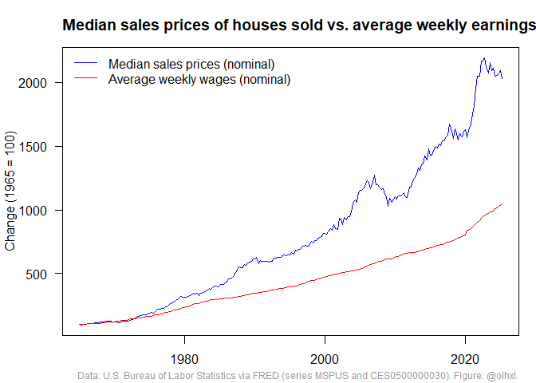

I guess this looks slightly less bad although it still means that house
prices rose twice as fast (20x compared to 1965, compared to 10x for
earnings).

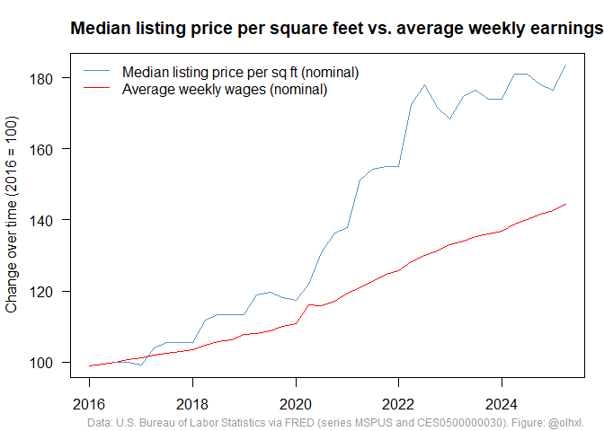
