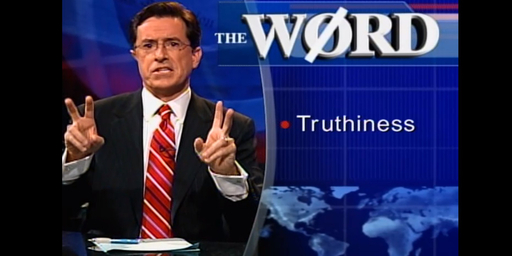

Reading Meehl's 'Appraising and Amending Theories'
==================================================
2025-11-26 12:00:00 -5000

Appraising and Amending Theories: The Strategy of Lakatosian Defense and Two Principles That Warrant It  
Paul E. Meehl (1990).  
_Psychological Inquiry_, 1(2), 108-141  
https://doi.org/10.1207/s15327965pli0102\_1

# The very short of it
When a theory's predictions fail, we have to decide whether to abandon the theory wholesale or to fiddle with some secondary elements in order to save it. How do we decide whether it's worth the trouble and which parts to change? It's worth when the theory has previously made precise and unexpected predictions. Changes are admissible when they concern non-core parts and when they are derived from the core parts and they result in new predictions that pass new empirical tests. Social sciences have a hard time generating "worthy" theories because their predictions are usually neither precise nor unexpected. This is due to the crud factor and an inappropriate use of significance tests. Social scientists should abandon null hypothesis significance tests of directional predictions (dy/dx > 0), try to generate predictions that are better than directional without being point predictions (e.g. ranges or functional form), and focus on deriving consequences from numerical agreements arrived at from qualitatively diverse observational avenues.

# The author's own summary
The short version of the argument is on pp. 121-2 (start with last paragraph p. 121, stop before subsection "_H_0 Testing in Light of the Lakatos-Salmon Principle"):

> Let the expression Lakatosian defense designate the strategy outlined by Lakatos in his constructive amendment of Popper, a strategy in which one distinguishes between the hard core of _T_ [the theory that we want to test] and the protective belt. In my notation Lakatos's protective belt includes the peripheral portions of _T_, plus the theoretical auxiliaries _A_t, the instrumental auxiliaries _A_i, the ceteris paribus clause _C_p, the experimental conditions _C_n, and finally the observations _O_1, _O_1. The Lakatos defense strategy includes the negative heuristic which avoids (he said _forbids_) directing the arrow of the _modus tollens_ at the hard core. To avoid that without logical contradiction, one directs the arrow at the protective belt.
>
> [...]
>
> The tactics within the Lakatosian defensive strategy may vary with circumstances. As mentioned earlier, we may refuse to admit the falsifying protocol into the corpus, or raise doubts about the instrumental auxiliary, or challenge the ceteris paribus clause, or the theoretical auxiliaries, or finally, as a last ditch maneuver, question the peripheral portions of the substantive theory itself. Nobody has given clear-cut _rules_ for which of these tactics is more rational, and I shall not attempt such a thing. At best, we could hope to formulate rough guidelines, rules of thumb, "friendly advice," broad principles rather than rules (Dworkin, 1967). [...]
>
> When is it rational strategy to conduct a Lakatosian defense? Here we invoke the Lakatos principle. We lay down that it is not a rational policy to go to this much trouble with amendments of _T_ or adjustments of auxiliaries unless the theory already has money in the bank, an impressive track record, and is not showing clear symptoms of a degenerating research program.
>
> How does a theory get money in the bank—how does it earn an impressive track record? We rely on the basic epistemological principle that "If your aim is a causal understanding of the world, do not attribute orderliness to a damn strange coincidence." [...] We apply this maxim to formulate Salmon's principle: that the way a theory gets money in the bank is by predicting observations that, absent the theory, would constitute damn strange coincidences. [...] It does this by achieving a mixture of _risky successes_ (passing strong Popperian tests) and _near-misses_, either of these being Salmonian damn strange coincidences.

# My summary
Here I try to summarize the central argument. Hopefully, you will find it easier to skim the article with this summary under your belt. I omit those parts where Meehl discusses how philosopher of science and "metatheoricians" (i.e. empirical studies of development of scientific theories) should measure the "success" of theories.

The starting paradox is this: In the physical sciences, greater statistical power (better instruments or experimental design, more observations) makes it _harder_ to pass significance tests (it becomes easier to detect differences between the measured and the predicted quantity); in the social sciences, greater statistical power makes it _easier_ to pass significance tests (it becomes easier to reject _H_0 = "there is no effect").

This creates the social scientist's dilemma: either perform the null ritual (pretend that "A causes B" is equivalent to dy/dx > 0; pretend that anyone believes _H_0: dy/dx = 0; show that _p(data|H_0_)_<0.05; claim [implicitly] "this shows that A causes B") or give up on improving our understanding of the world and get a job increasing ad revenue for billionaires.

The less flippant version of the dilemma is: "everything is correlated with everything" (the crud factor, see below); we do not have theories strong enough to generate predictions beyond dy/dx > 0; crud factor & dy/dx > 0 => many, many nonsense theories will pass significance tests. 

Meehl thinks we need not throw out the baby with the bath water and we can distinguish between better and worse theories without using significance tests.

When we conduct an empirical test of a substantive theory, it is not equivalent to deciding whether the sentence "the apple is on the table" is true or false. Theories are more complex than that. Meehl suggests that the logical form of an empirical test of a substantive theory is:

(_T_ + _A_t + _C_p + _A_i + _C_n) -> (_O_1 ⊃ _O_2)

In verbal form: If you believe (Theory + auxiliary substantive theories + ceteris paribus + auxiliary theories about instrumentation + particulars about the experimental conditions)  then you must believe (when we observe _O_1 we will also observe _O_2). We'll get to the meaning of the individual terms later. They roughly mean what you think they mean. 

If it happens that we observe _O_1 _but we do not observe_ _O_2, then we must reject the entire left-hand side. This is what is referred to as _modus tollens_ (if you argue P->Q and then you observe Q but not P, it follows that P->Q is incorrect). I will use LHS as shorthand for the entire thing within parentheses left of '->'.

If we observe _O_1 but not _O_1, we have _falsified_ the LHS in Popper-speak.

If we observe _O_1 _and_ _O_2, we have _corroborated_ the LHS in Popper-speak.

Strictly logically speaking, we have not "proved" or "confirmed" or whatever the LHS. So we do we bother? Because, as practising scientists, our publications make the (implicit) claim that, _absent T_, there is little reason to expect "if _O_1 then _O_2." This is where the crud factor becomes a problem.

The proposition "if not for _T_, 'if _O_1, then  _O_1' is unlikely [implausible, nonsensical, whatever]" is more believable the more detailed _T_,  _O_1, and _O_1 are. Meehl gives the following example (p. 110). A meteorological theory that predicts that it will rain next April is not very interesting. One that correctly predicts on which five days it will rain is more interesting. One which correctly predicts the exact amount it will rain on each of these five days is very interesting.

Now, in the real world, we rarely abandon _T_ because the RHS did not pan out. More likely, we put the blame on some of the other elements and adjust them. Most of time, we know that one or more of the LHS elements are not strictly speaking true. So, the question becomes: _when is it worth it and appropriate to fiddle with the different parts of LHS->RHS, except for the core parts of T?_

To answer this question, we must:

- identify the core parts of _T_
- decide if _T_ is a "progressive" or "degenerate" research program
- decide which parts of LHS->RHS can be changed
- decide whether _T_ has enough "money in the bank" to be worth the trouble

## How to identify the core parts of _T_
I don't know. Meehl only gives two examples from psychology (point 12, p. 112). He seems to suggest that if you know a certain domain, you will also know which concepts are core and which can be tweaked. I'm not sure what a good demographic equivalent would be. Maybe it's the difference between demographers disagreeing about which causal factors are most important while agreeing to focus only on observable social and material factors and someone who wants to explain population change with God's favor or chemtrails.

## How to identify a "progressive" or "degenerate" research program
"Progressive"  = when our ad hockery leads to new predictions, these new predictions pass new empirical tests, and our ad hockery mobilizes existing elements of our theory instead of unrelated external ones.

"Degenerate" = when an excessive amount or a bad kind of ad hockery is required to save _T_. Ad hockery is bad when it does not fulfill the three requirements above (new facts, pass tests, related to core _T_).

Point 11 on p. 111

## How to decide what to change and how (good vs. bad ad hockery)
Which parts of LHS->RHS should we change? And how?

First, let's clear up terminology.

- _A_t and _A_i, auxiliary beliefs/assumptions about substantive topics and about instrumentation/observation (assumed to be correct and complete). _A_i means beliefs/assumptions about our means of control (e.g. administering a treatment and ensuring compliance) and observation (e.g. measuring completed fertility via survey). _A_t means supplemental theories about concepts relevant to _T_ (e.g. humans have preferences and try to act in accordance to them). The demarcation between _T_, _A_i, and _A_t is not always clear.
- Ceteris paribus _C_p ("all else being equal"): in its strongest sense, it implies that there is nothing that influences O1 and O2 that is not containted in _T_. Obviously, that is not true. What we (implicitly) believe is "nothing else is at work except factors that are totally random and therefore subject to being dealt with by our statistical methods." And even that might not be true or we might not really believe it (and even less often state it as an assumption).
- _C_n, particulars about the experimental conditions: what was the exact protocol? Do we think it was run appropriately? Do we think it was reported honestly?

Most commonly, we adjust _C_p and _A_t. Especially if we "tested" _T_ in different contexts or subgroups, and our test worked in some but not all. Basically, we say "oh it seems like there are some systematic [confounders, mediators, whatever] in this particular context/subgroup." And then we move some bits from _C_p into _A_t or _T_.

One risk is that we introduce new constructs into _A_t as we adjust _C_p. Then, we have to explain why these new theories explain our failure in that one context/subgroup but do not change our predictions or results in the other contexts/subgroups. "We do not want to be guilty of gerrymandering the ad hockery we perform on our auxiliaries!" (p. 111)

## "Money in the bank" a.k.a. the "track record" principle a.k.a the Serlin-Lapsley principle

While our theories are almost certainly incomplete and false in the literal sense, they may be "good enough." For example, the current most precise and explicit theory of the physical and chemical processes making up our sun will likely turn out to be missing some parts and have some parameters wrong (at some level of precision). Does that mean it's wrong? Does that mean it's wrong to say that the sun is a big ball of hot gas, mostly hydrogen? Does that mean it's no better than the theories that the sun is a glowing gigantic iron cannonball (Anaxagoras) or the chariot of the sun god? (Meehl's examples)

Good enough means "having enough verisimilitude to warrant continued effort and testing it, amending it, and fiddling in honest ad hockery (not ad hoc of Lakatos's three forbidden kinds) with the auxiliaries." (p. 115, Meehl's formulation)

### What the Stephen is verisimilitude? 

For the long version, read the section intitled "Excursus: The Concept of Verisimilitude." The short of it is that we basically never think of a theory as completely true or false. We have an intuitive sense for the "truthiness" of a theory. Meehl gives the example of a newspaper account of a car accident. If the account gets everything right except for the middle name of one of the drivers, we would not call the account "false." If it gets a driver's entire name and the name of the street wrong, we might think it poor journalistic craftsmanship but still somewhat true. Similarly, because a theory consists of so many different things (entities, relationships, functional forms, parameters), some of these can be wrong or inaccurate in different ways without us thinking that the theory is entirely without merit. 

### How does a theory get money in the bank?

The _Salmon principle_ (Wesley Salmon, not the fish): "The main way a theory gets money in the bank is by predicting facts that, absent the theory, would be antecedently improbable." (p. 115)

The "damn strange coincidence" maxim (a.k.a. Reichenbach's maxim, a.k.a Novalis's maxim): "If your aim is causal understanding of the world, do not adopt a policy of attributing replicable orderliness of observations to a damn strange coincidence." (p. 117)

The more precise your predictions are, the more money you accumulate and the more we are inclined to count even "near misses" in your favor. See the example above about predicting rainfall in April.

## Why are things particularly bad for the social sciences?
Social science theories have a hard time convincing the reader that "if not for _T_, 'if _O_1, then  _O_1' is unlikely [implausible, nonsensical, whatever]." Basically, social science theories produce few "damn strange coincidences" and, therefore, generate little money in the bank.

Why do they generate so few damn strange coincidences?

Because of the _crud factor_. Duhduhduhhhhhhh...

The _crud factor_: "Everything is correlated with everything, more or less." (p. 123) Meehl thinks that this is obvious to anyone with more than cursory experience with social science research.  As an illustration, he talks about his experience with the the Minnesota Multiphasic Personality Inventory (MMPI). The long version of this is in Meehl 1990 [[2]](#2) (Section "6. Crud factor", Why summaries of research on psychological theories are often uninterpretable Psychological reports, 66, 195-244):

> The main point is that, when the sample size is sufficiently large to produce accurate estimates of the population values, almost any pair of variables in psychology will be correlated to some extent. Thus, for instance, less than 10% of the items in the MMPI item pool were put into the pool with masculinity–femininity in mind, and the empirically derived _Mf_ scale contains only some of those plus others put into the item pool for other reasons, or without any theoretical considerations. When one samples thousands of individuals, it turns out that only 43 of the 550 items (8%) fail to show a significant difference between males and females. [...] when Lykken and I ran chi squares on all possible pairwise combinations of variables, 92% were significant, and 78% were significant at p < 10–6. Looked at another way, the median number of significant relationships between a given variable and all the others was 41 of a possible 44. One finds such oddities as a relationship between which kind of shop courses boys preferred in high school and which of several Lutheran synods they belonged to! (p. 124)
>
> [...]
>
> _The crud factor is not a Type I error._ [...] The problem is methodological, not statistical: there are too many available and plausible explanations of an _xy_ correlation, and, besides, these explanations are not all disjoint but can often collaborate." (p. 125)

# So, what now?
A big chunk of the second half of the article is about how to measure the "track record" of a research program. Meehl admits that his proposed index is rough and tentative. I will ignore that entire topic and try to pull out the bits that might be interesting for social scientists.

A central recommendation by Meehl is to stop bothering with p-values and to focus instead on predictions and how far off they are. 

Predictions are a bit of a bogeyman for social scientists. Meehl highlights that saying "we expect children from poor households to have lower education" is equivalent to predicting  "the [beta coefficient, correlation coefficient] between poverty and education is significantly different from zero and negative." That is still a prediction albeit verbal, vague, and broad. Meehl suggests that one need not make accurate and uber-precise point predictions to make progress. Making interval predictions or functional-form predictions _and then (hopefully) finding empirical agreement from different measurement approaches_ would do a lot more than yet another study with _beta_bla\*\*\*. More details in sections "Appraising a Theory: Point and Interval Predictions" and "Appraising a Theory: Function-Form Predictions".

How do we measure how far off we are? Here is Meehl:

> The crucial thing is, I urge, not the standard error, or even (somewhat more helpful) the engineer's familiar percentage error, but _the size of the error in relationship to the Spielraum_ [range of potential values considered reasonable]. p. 128

First off, no p-values a measure of how far off we are, at least if they're used the way 99% of social science studies use them. P-values (in null hypothesis significance tests) give you the probability of observing a given coefficient (usually some correlation between _y_ and _x_) if there _were absolutely no relation_ between the two variables. But nobody actually believes that last part. So the p-value is pretty much useless. Meehl argues that we should not be interested in how big the error is in relation to the variance of the particular study/sample/context in which it was estimated but how big it is in relation to _the range of potential values of the parameter predicted by our theory_ [he calls this "Spielraum" because he wants to show that he has read some Austrian logical positivists]. For example, if you measured a distance and you tell us that you were off by 1000 miles, our applause will depend a lot on whether you wanted to measure the distance between two cities, between the earth and the moon, or between the sun and Alpha Centauri. Even before doing any measurement, if your outcome measure goes from -1 to 1 and you predict that it should be > 0, that is a lot less impressive than if you predict that it should be between 0.1 and 0.3. Now imagine that you measure it to be 0.4. In the first scenario, you "succeeded." In the second scenario, you "failed." But Meehl thinks that the second theory would deserve a lot more attention than the first because it made a prediction that covered only 0.1 of the space of the outcome variable (as opposed to 0.5) and its error was 0.05 of that space. 

How to put this into practice? I don't know. But here are some connections to existing work.

_Define your estimand (g*ddamn)_. The connections to the Lundberg et al. paper [[3]](#3) should be pretty obvious. Figure 2 in this paper and figure 1 in Lundberg et al. express the same idea. Not that this really clarifies things. As we discussed last time, the practical implications of Lundberg et al. are not very clear. 

_Multiverse analyses_. Multiverse analyses were developed, afaik, as a counter to p-hacking and harking. But you could also use them as a first step towards defining a plausible range for predictions or a partial estimate of the "crud factor" for some topic. 

_Regularized effect sizes_. I wonder what Meehl thought off Cohen's _d_ and similar efforts. I didn't google it and I think it could be cool to think through it before doing so. Since most of these use some measure of the variability in the sample, I am tempted to say that Meehl would say that they are slightly besides the point. But he talk about the error not the effect estimate. If we extend his point, I would suspect that he would insist on substantive over statistical significance and the importance to find some appropriate loss function (i.e. an effect of this size translates into real-world effects of this much life expectancy gained for this amount of investment).

_Type S and M errors_. Andrew Gelman and John Carlin [[4]](#4) suggested that when assessing a corpus of studies in light of file drawer problems or replication efforts or when doing ex ante power calculations for a studies, we should not focus type I and II errors but on type _S_ and _M_ errors. _S_ means we get the size wrong and _M_ means we get the magnitude wrong. 

# Bonus: Is It _Ever_ Correct to Use Null-Hypothesis Significance Tests?
Actually, yes, there are situation where NHST is appropriate. See p. 137. One of the examples: when we are only interested in evaluating a technique, like a new medication or fertilizer. If one shows 7% "more" effect than another, we only want to know how likely that is to arise by chance. If it's different from chance, we want to do the thing, never mind what we think of the motivating theory.

# References
<a id="1">[1]</a>
Appraising and Amending Theories: The Strategy of Lakatosian Defense and Two Principles That Warrant It  
Meehl, P. E. (1990).  
_Psychological Inquiry_, 1(2), 108-141.  
[https://doi.org/10.1207/s15327965pli0102_1](https://doi.org/10.1207/s15327965pli0102_1)

<a id="2">[2]</a>
Why summaries of research on psychological theories are often uninterpretable  
Meehl, P. E. (1990).  
Psychological reports, 66(1), 195-244.  
[https://psycnet.apa.org/doi/10.2466/PR0.66.1.195-244](https://psycnet.apa.org/doi/10.2466/PR0.66.1.195-244)

<a id="3">[3]</a>
What Is Your Estimand? Defining the Target Quantity Connects Statistical Evidence to Theory  
Lundberg, I., Johnson, R., and Stewart, B. M. (2021).  
American Sociological Review, 86(3), 532-565.  
[https://doi.org/10.1177/00031224211004187](https://doi.org/10.1177/00031224211004187)

<a id="4">[4]</a>
Beyond Power Calculations: Assessing Type S (Sign) and Type M (Magnitude) Errors  
Gelman, A. and Carlin, J. (2014).  
Perspectives on Psychological Science, 9(6) 641-651.  
[https://doi.org/10.1177/1745691614551642](https://doi.org/10.1177/1745691614551642)
